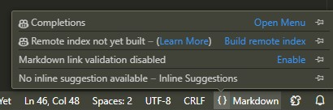
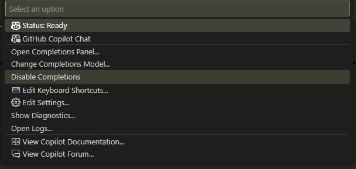

# C++ Primer Plus (6th Edition) — Exercises Implementation

本專案為 **《C++ Primer Plus 第六版》 (Stephen Prata 著)** 的章節練習題實作，
目標是透過逐章練習，加強 C++ 語法、標準函式庫 (STL)、面向物件程式設計、以及進階功能的掌握。

---

## 📂 專案目錄結構

```
.
├── ch02/      # Chapter 02: Introducing C++
├── ch03/      # Chapter 03: Dealing with Data
├── ch04/      # Chapter 04: Compound Types
├── ch05/      # Chapter 05: Loops and Relational Expressions
├── ch06/      # Chapter 06: Branching Statements and Logical Operators
├── ch07/      # Chapter 07: Functions: C++'s Programming Modules
├── ch08/      # Chapter 08: Adventures in Functions
├── ch09/      # Chapter 09: Memory Models and Namespaces
├── ch10/      # Chapter 10: Objects and Classes
├── ch11/      # Chapter 11: Working with Classes
├── ch12/      # Chapter 12: Classes and Dynamic Memory Allocation
├── ch13/      # Chapter 13: Class Inheritance
├── ch14/      # Chapter 14: Reusing Code in C++
├── ch15/      # Chapter 15: Friends, Exceptions, and More
├── ch16/      # Chapter 16: The string Class and the Standard Template Library
├── ch17/      # Chapter 17: Input, Output, and Files
└── README.md  # 專案說明文件
```

---

## 講義連結

- [Links](https://drive.google.com/file/d/1s0lin3w3Crn6KOoJZiqjQLjAITAxalUz/view?usp=drive_link)

---

## 關閉(開啟) VS Code 的 AI Copilot
為避免 AI Copilot 打擾練習，這邊附上關閉特定程式語言的 AI copilot 的方法

1. 點擊 `VS Code` 右下角的 `{}`
2. 點擊第一個 `Completions` 的 `Open Menu`



3. 點擊第一項 `Enable/Disable Completions` 進行關閉 (開啟)


---

## 🚀 如何執行

1. 確認已安裝 **C++14** 或以上版本的編譯器（如 `g++`, `clang++`）。
2. 切換到指定章節資料夾，例如：

   ```bash
   cd ch03
   g++ exercise3_1.cpp -o exercise3_1
   ./exercise3_1
   ```
3. 不同檔案為對應練習題目，可單獨編譯與執行。

---

## 📖 學習目標

* 依章節循序漸進，練習 C++ 的核心語法與觀念
* 熟悉 **STL (Standard Template Library)** 的常用容器與演算法
* 建立良好的 **程式架構與模組化設計**
* 為進一步學習 **演算法設計與系統開發** 打下基礎

---

## 🛠️ 環境需求

* 作業系統：Linux / macOS / Windows
* 編譯器：

  * GCC (g++ 9.0 以上，支援 C++14)
  * 或 Clang (支援 C++14)
* 其他：可搭配 VSCode、CLion、或任何 C++ IDE

---

## 📌 待辦事項

* [ ] 完成 **Ch08** 所有練習題
* [ ] 持續更新章節目錄與程式碼

---

## References

- https://github.com/DercyCheng/CPP/tree/main
